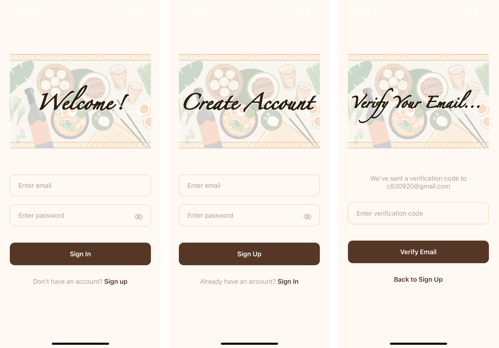

# Recipe Application
## Overview
A full-stack cross-platform mobile app built with **React Native + Expo** that lets users discover and favorite recipes. The app uses **Clerk** for authentication, fetches recipes from a public API, and stores user-specific favorites via a custom **Node.js + Express** backend deployed on **Render**, using **PostgreSQL** with **NenoDB + Drizzle ORM**.

Below are screenshots of the app's SignIn, Register, and Email Verification pages:


Below are screenshots of the Recipe Home, Search, Favorites, and Recipe Detail pages:


## Objectives
Finding the right meal to cook can be time-consuming, especially when browsing through countless recipe sources. This project aims to simplify the process by:
1. Fetching recipes from a public meal API based on keywords and categories.
2. Allowing users to search, view, and favorite recipes in an intuitive mobile interface.
3. Supporting user-specific favorite lists through secure authentication and persistent storage.
4. Improving search performance with debounce and efficient API communication.

## Technologies and Frameworks
* **Backend**:
   * Node.js & Express: RESTful API development
   * PostgreSQL: Database for storing user favorites
   * [NenoDB](https://neon.com/) + Drizzle ORM: Type-safe database interaction
   * [Clerk](https://clerk.com/): User authentication management
   * [Render](https://render.com/): Backend deployment platform
   * [TheMealDB API](https://www.themealdb.com/api.php): External data source for recipes
* **Frontend**:
   * React Native with Expo: Cross-platform mobile development
   * expo-router: App navigation management
   * [Clerk](https://clerk.com/): User authentication management
   * Custom React Hooks** (e.g., `useDebounce`) – Enhanced UX
   * fetch API: Lightweight HTTP requests
   * StyleSheet: UI styling

## Architecture Overview
* **Backend Architecture**:
- Exposes RESTful endpoints (`GET`, `POST`, `DELETE`) to manage user favorites.
- Secure endpoints with Clerk authentication middleware.
- Uses NenoDB + Drizzle ORM to interact with PostgreSQL.
- Hosted on **Render** with publicly accessible API endpoints.

* **BFrontend Architecture**:
- Built with React Native and Expo, with modular component structure.
- Handles navigation using **expo-router**.
- Authenticates users and securely stores session data via Clerk.
- Fetches recipes from **TheMealDB API** and favorites from backend.
- Implements debounced search to reduce redundant API calls.


## How to Build and Run

**Note:** The backend API is already deployed on Render. You can run the frontend locally and connect directly to the deployed backend without setting up the server yourself.

#### Prerequisites
1. Node.js
2. Expo CLI
3. Clerk account (for authentication)
4. Optional: NenoDB + PostgreSQL + Render (only if you want to self-host backend)


#### Backend Setup (Optional)
1. Clone the repository and enter the backend directory:
   ```bash
   cd backend
   npm install
   ```

2. Set up environment variables (.env):
   ```bash
   PORT=5000
   DATABASE_URL=<your_postgres_url>
   ```

3. Run the backend server:
   ```bash
   npm run dev
   ```

#### Frontend Setup
1. Install dependencies:
   ```bash
   cd mobile
   npm install
   ```

2. Create a .env file with:
   ```bash
   EXPO_PUBLIC_CLERK_PUBLISHABLE_KEY=your_clerk_publishable_key
   ```

3. Start the Expo development server:
   ```bash
   npx expo
   ```

## Results
1. Fully functional recipe browsing and favoriting features.
2. Secure user authentication with Clerk.
3. Stable backend API connected to PostgreSQL, deployed on Render.
4. Responsive and user-friendly UI with category filtering and search.
5. Debounced search input improves performance and user experience.

## Conclusion
This project demonstrates a lightweight yet complete full-stack application with mobile-friendly UX and persistent user data. It integrates multiple modern tools (React Native, Expo, Clerk, Drizzle, PostgreSQL) to create a smooth user experience for recipe exploration and bookmarking.

## Future Work
1. Add multi-language support to expand user base.
2. Implement recipe rating and commenting features to enhance community engagement.
3. Improve search algorithm for personalized recommendations.
4. Develop a web version to broaden platform accessibility.
